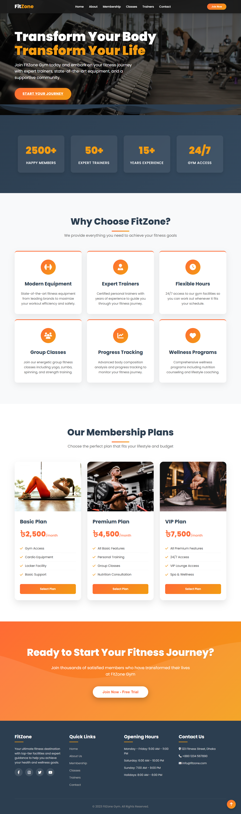

# FitZone - One-Page Fitness Template

 <!-- It's highly recommended to add a screenshot of your project here -->

A sleek, modern, and fully responsive one-page template designed for fitness centers, gyms, personal trainers, and wellness studios. Built with semantic HTML5, modern CSS3, and vanilla JavaScript, FitZone is lightweight, easy to customize, and ready to deploy.

**[➡️ View Live Demo](https://mostofa-rezvi.github.io/FitZone_HTML_Template/)**

---

## ✨ Features

*   **Hero Section:** A welcoming header with a strong call-to-action.
*   **About Us:** Share your story and mission.
*   **Classes/Services:** Showcase the programs you offer.
*   **Schedule:** A clean timetable for classes.
*   **Pricing Plans:** Simple and clear pricing tiers.
*   **Our Trainers:** Introduce your expert team.
*   **Contact Form:** A functional contact section with a map.
*   **Fully Responsive:** Looks great on all devices, from mobile phones to desktops.
*   **Smooth Scrolling:** Seamless navigation between sections.
*   **Mobile Navigation:** A user-friendly hamburger menu for smaller screens.
*   **Minimal Dependencies:** Built with just HTML, CSS, and vanilla JS. No frameworks, no fuss.

---

## 🛠️ Tech Stack

*   **HTML5:** Semantic and accessible markup.
*   **CSS3:** Modern layouts using Flexbox and Grid, with custom properties for easy themeing.
*   **Vanilla JavaScript:** For interactive elements like the mobile menu, smooth scrolling, and form validation without the overhead of a library.

---

## 🚀 Getting Started

To get a local copy up and running, follow these simple steps.

### Prerequisites

You just need a web browser and a code editor.

### Installation

1.  Clone the repo:
    ```sh
    git clone https://github.com/your-username/fitzone.git
    ```
2.  Navigate to the project directory:
    ```sh
    cd fitzone
    ```
3.  Open `index.html` in your favorite browser.

**Pro Tip:** For the best development experience, use a live-server extension in your code editor (like VS Code's "Live Server") to see your changes update in real-time.

---

## 🎨 Customization

Customizing the template is straightforward:

1.  **Content:** All content is in the `index.html` file. Simply open it and edit the text, links, and image paths to match your own.
2.  **Styling:**
    *   Open `css/style.css` to make changes.
    *   Key branding colors, fonts, and spacing are defined as CSS variables at the top of the file for quick and easy theme changes.
    ```css
    :root {
      --primary-color: #ff5733; /* Change this to your brand color */
      --secondary-color: #333;
      --font-family: 'Poppins', sans-serif;
    }
    ```
3.  **Images:** Replace the placeholder images in the `assets/images/` directory with your own.
4.  **JavaScript:** The `js/main.js` file contains the logic for the mobile menu, smooth scrolling, and other interactive features. You can modify or extend it as needed.

---

## 🤝 Contributing

Contributions, issues, and feature requests are welcome! Feel free to check the [issues page](https://github.com/your-username/fitzone/issues).

1.  Fork the Project
2.  Create your Feature Branch (`git checkout -b feature/AmazingFeature`)
3.  Commit your Changes (`git commit -m 'Add some AmazingFeature'`)
4.  Push to the Branch (`git push origin feature/AmazingFeature`)
5.  Open a Pull Request

---

## 📄 License

This project is distributed under the MIT License. See `LICENSE.txt` for more information.

---

## 🙏 Acknowledgements

*   Images from [Unsplash](https://unsplash.com) / [Pexels](https://www.pexels.com)
*   Icons from [Font Awesome](https://fontawesome.com) (or your chosen icon library)
*   Font from [Google Fonts](https://fonts.google.com/)
